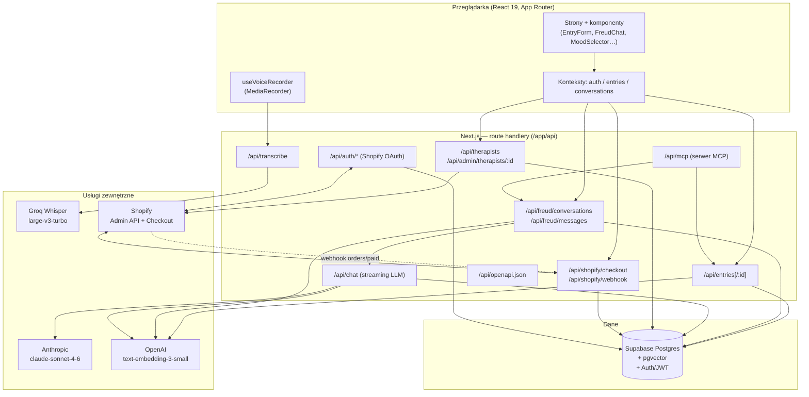

# Architektura systemu — Dzienniczek

> Dokument opisuje rzeczywistą architekturę na podstawie kodu w repozytorium
> (`app/`, `lib/`, pliki konfiguracyjne, `.env.local`). Elementy, których nie dało
> się potwierdzić z plików, są oznaczone jako `[do weryfikacji]`.

## 1. Przegląd systemu

Dzienniczek to aplikacja webowa do prowadzenia osobistego dziennika z wbudowanym
asystentem terapeutycznym ("Freud"). Użytkownik tworzy wpisy (tytuł, treść, nastrój,
tagi, opcjonalnie nagrane głosem i transkrybowane), a następnie może rozmawiać z
asystentem AI, który korzysta z historii wpisów i wyszukiwania semantycznego
(RAG), by odpowiadać kontekstowo. Dostępni są różni "terapeuci" (persony) — część
darmowa, część płatna, sprzedawana przez Shopify. System jest zbudowany jako jedna
aplikacja Next.js (frontend + route handlery API), z Supabase jako bazą danych i
warstwą uwierzytelniania, oraz integracjami z zewnętrznymi modelami AI (Anthropic,
OpenAI, Groq). Dodatkowo aplikacja wystawia serwer MCP, udostępniający operacje na
wpisach i rozmowach jako narzędzia dla agentów.

## 2. Diagram architektury



## 3. Komponenty

| Komponent | Odpowiedzialność | Technologia |
|---|---|---|
| **Frontend (App Router)** | Strony: lista wpisów (`/`), nowy/edycja/podgląd wpisu (`/new`, `/[id]`, `/[id]/edit`), czat (`/freud`), terapeuci (`/therapists`), panel admina (`/admin/therapists`), logowanie (`/login`), dokumentacja (`/docs`). | Next.js 16, React 19, TypeScript |
| **Komponenty UI** | `EntryForm`, `EntryCard`, `EntrySidebar`, `MoodSelector`, `TagInput`, `FreudChat`, `FreudFloating`, `BottomNav`, `DeleteConfirm` + shadcn/ui (`button`, `dialog`). | React, shadcn/ui, Tailwind CSS v4, Heroicons |
| **Stan klienta** | `auth-context` (sesja użytkownika), `entries-context` (wpisy), `conversations-context` (rozmowy czatu). | React Context |
| **Nagrywanie głosu** | `useVoiceRecorder` — przechwytuje audio i wysyła do `/api/transcribe`. | MediaRecorder API |
| **API: wpisy** | CRUD wpisów, listowanie z filtrowaniem/paginacją, generowanie embeddingów przy zapisie. | Next.js route handlers, Zod |
| **API: Freud / czat** | Tworzenie rozmów, zapis wiadomości, streaming odpowiedzi LLM z kontekstem RAG. | AI SDK (`ai`, `@ai-sdk/anthropic`) |
| **API: transkrypcja** | Przyjmuje plik audio (multipart) i zwraca tekst. | Groq Whisper |
| **API: terapeuci** | Lista person z flagą dostępu (free/kupione) wzbogacona danymi produktu z Shopify; admin: edycja terapeuty. | Next.js, Supabase |
| **API: Shopify** | Generowanie linku do koszyka (checkout) i odbiór webhooka `orders/paid` nadającego dostęp. | Shopify Admin API, HMAC |
| **API: OAuth Shopify** | Instalacja aplikacji w sklepie — `/api/auth` + `/api/auth/callback`, zapis offline tokenu. | OAuth 2.0, HMAC |
| **Serwer MCP** | Wystawia narzędzia (`create_entry`, `list_entries`, `get_entry`, `create_conversation`, `list_conversations`, `send_message`, `get_messages`) wywołujące wewnętrzne API. | `@modelcontextprotocol/sdk` (Streamable HTTP) |
| **OpenAPI** | Generuje specyfikację OpenAPI wystawianego API (`/api/openapi.json`), prezentowaną w `/docs`. | `lib/openapi.ts` |
| **Warstwa API (`lib/api`)** | `middleware` (weryfikacja JWT, walidacja Zod, obsługa błędów), `supabase-server` (operacje DB), `validators` (schematy Zod), `embeddings` (klient OpenAI). | TypeScript |

## 4. Źródła danych

Pojedyncza baza **Supabase Postgres** (z rozszerzeniem **pgvector**) jest źródłem
prawdy. Tabele zidentyfikowane z kodu (`.from(...)`):

| Tabela | Co przechowuje | Jak jest odpytywana |
|---|---|---|
| `entries` | Wpisy dziennika: `user_id`, `title`, `content`, `mood`, `tags[]`, `image_url`, `embedding` (wektor), `created_at`, `updated_at`. | CRUD przez klienta service-role; filtrowanie po nastroju/tagach/dacie, paginacja. Wyszukiwanie hybrydowe przez RPC. |
| `conversations` | Rozmowy z Freudem: `user_id`, `entry_id` (opcjonalny kontekst), `title`. | Tworzenie, listowanie, aktualizacja tytułu. |
| `messages` | Wiadomości w rozmowie: `conversation_id`, `role` (`user`/`assistant`), `content`. | Zapis i listowanie chronologiczne. |
| `therapists` | Persony asystenta: `name`, `slug`, `description`, `system_prompt`, `greeting_prompt`, `badge` (`free`/`paid`), `shopify_product_id`, `is_active`, `sort_order`. | Listowanie aktywnych, dopasowanie po slug/`shopify_product_id`. |
| `user_therapists` | Nadane dostępy do płatnych terapeutów: `user_id`, `therapist_id`, `shopify_order_id`, `purchased_at`. | Upsert z webhooka, odczyt przy listowaniu terapeutów. |
| `shopify_credentials` | Offline access token sklepu: `shop`, `access_token`, `scope`, `updated_at`. | Upsert w callbacku OAuth, odczyt (z cache w module) przy wywołaniach Admin API. |

**Wyszukiwanie semantyczne (RAG):** funkcja RPC `hybrid_search_entries(p_user_id,
p_query_embedding, p_query_text, p_limit)` łączy wyszukiwanie wektorowe (pgvector) z
pełnotekstowym metodą **RRF (Reciprocal Rank Fusion)**. Embeddingi liczone modelem
OpenAI `text-embedding-3-small`.

> `[do weryfikacji]` Dokładny schemat tabel, indeksy (HNSW/IVFFlat dla pgvector),
> polityki RLS oraz ciało funkcji `hybrid_search_entries` nie znajdują się w repo
> (brak katalogu migracji) — istnieją po stronie projektu Supabase.

## 5. Integracje i połączenia

| Integracja | Kierunek | Uwierzytelnianie (typ) |
|---|---|---|
| **Supabase (DB + Auth)** | out (zapytania), in (weryfikacja JWT) | Service-role key po stronie serwera; JWT użytkownika weryfikowany w `verifyAuth`. Klient publiczny używa anon key. |
| **Anthropic** (`claude-sonnet-4-6`) | out | Klucz API (`ANTHROPIC_API_KEY`) — czytany automatycznie przez AI SDK. Streaming odpowiedzi czatu. |
| **OpenAI** (embeddings) | out | Bearer `OPENAI_API_KEY`. Wywoływane przy zapisie wpisu i przy zapytaniu czatu. |
| **Groq** (Whisper) | out | Bearer `GROQ_API_KEY`. Transkrypcja audio → tekst. |
| **Shopify Admin API** | out | Nagłówek `X-Shopify-Access-Token` (offline token z OAuth); scope `read_products`. Pobieranie danych produktów. |
| **Shopify OAuth** | in/out | Weryfikacja HMAC-SHA256 zapytania (`SHOPIFY_CLIENT_SECRET`), state-nonce w cookie (CSRF). Wymiana `code` → offline token. |
| **Shopify Webhook** `orders/paid` | in | Weryfikacja HMAC-SHA256 ciała (`SHOPIFY_WEBHOOK_SECRET`, base64). Nadanie dostępu do terapeuty. |
| **Shopify Checkout** | out (redirect) | Brak tokenu — generowany permalink koszyka z `attributes[supabase_user_id]`. |
| **Serwer MCP** (`/api/mcp`) | in | Bearer token przekazywany dalej do wewnętrznego API. Transport: Streamable HTTP. |

## 6. Przepływ danych

**Tworzenie wpisu (z opcjonalnym głosem):**
1. (opcjonalnie) `useVoiceRecorder` nagrywa audio → `POST /api/transcribe` →
   Groq Whisper → tekst wraca do formularza.
2. `POST /api/entries` (Bearer JWT) → walidacja Zod → `createEntry` zapisuje wiersz
   w `entries`.
3. **Asynchronicznie** (bez blokowania odpowiedzi): `buildEmbeddingText` →
   OpenAI embedding → `updateEntryEmbedding` zapisuje wektor.

**Rozmowa z Freudem (RAG + streaming):**
1. `POST /api/freud/messages` (Bearer JWT) → weryfikacja właściciela rozmowy →
   zapis wiadomości użytkownika; przy pierwszej wiadomości ustawiany tytuł rozmowy.
2. Równolegle: pobranie ostatnich 50 wpisów + embedding zapytania (OpenAI).
3. `hybrid_search_entries` (pgvector + FTS, RRF) zwraca najbardziej powiązane wpisy.
   Jeśli OpenAI/RPC zawiedzie — degradacja łagodna (pusta lista, czat działa dalej).
4. Historia + kontekst przekazywane do `POST /api/chat` → `buildSystemPrompt`
   (persona terapeuty + skrót wpisów + aktywny wpis + wpisy powiązane) →
   `streamText` (Anthropic) zwraca strumień.
5. Strumień jest przekazywany do klienta i jednocześnie buforowany; po zakończeniu
   pełna odpowiedź asystenta zapisywana w `messages`.

**Zakup płatnego terapeuty (human-in-the-loop):**
1. `POST /api/shopify/checkout` (Bearer JWT) → `buildCartPermalink` z wariantem
   produktu i `supabase_user_id` w atrybutach.
2. **Użytkownik finalizuje zakup w Shopify** (bramka manualna / poza systemem).
3. Shopify wysyła webhook `orders/paid` → weryfikacja HMAC → odczyt
   `supabase_user_id` z `note_attributes` → dopasowanie produktu do terapeuty →
   upsert do `user_therapists` (nadanie dostępu).
4. Przy kolejnym `GET /api/therapists` użytkownik ma `hasAccess: true`.

**Instalacja w sklepie (OAuth):** `GET /api/auth` (weryfikacja shop + HMAC) →
redirect na ekran zgody Shopify → `GET /api/auth/callback` (weryfikacja state +
HMAC) → wymiana `code` na offline token → zapis w `shopify_credentials`.

## 7. Hosting i deployment

- **Platforma:** Vercel. Domyślny `BASE_URL` serwera MCP wskazuje
  `https://dzienniczek-katarzyna-smolen-projects.vercel.app` (nadpisywalny przez
  `NEXT_PUBLIC_APP_URL`). README wymienia "Deployment na Vercel" jako etap roadmapy.
- **Uruchomienie lokalne:** `npm run dev` (`next dev`) → `http://localhost:3000`;
  produkcyjnie `npm run build` + `npm run start`.
- **Storybook:** `npm run storybook` (port 6006) — dokumentacja komponentów UI.
- **Testy:** Vitest + Playwright (browser) + addon Storybook/Vitest (`vitest.config.ts`).
- **Konfiguracja środowiska** (`.env.local`, niewersjonowany — tylko nazwy, bez wartości):

| Zmienna | Rola |
|---|---|
| `NEXT_PUBLIC_SUPABASE_URL` | URL projektu Supabase (klient + serwer) |
| `NEXT_PUBLIC_SUPABASE_ANON_KEY` | Publiczny klucz anon (klient) |
| `SUPABASE_SERVICE_ROLE_KEY` | Klucz service-role (operacje serwerowe) |
| `ANTHROPIC_API_KEY` | Dostęp do modelu czatu (AI SDK) |
| `OPENAI_API_KEY` | Embeddingi do wyszukiwania semantycznego |
| `GROQ_API_KEY` | Transkrypcja głosu (Whisper) |
| `SHOPIFY_STORE_DOMAIN` / `NEXT_PUBLIC_SHOPIFY_STORE_DOMAIN` | Domena sklepu `*.myshopify.com` |
| `NEXT_PUBLIC_SHOPIFY_CLIENT_ID` | Client ID aplikacji Shopify (OAuth) |
| `SHOPIFY_CLIENT_SECRET` | Sekret OAuth — weryfikacja HMAC i wymiana tokenu |
| `SHOPIFY_WEBHOOK_SECRET` | Weryfikacja HMAC webhooka `orders/paid` |
| `NEXT_PUBLIC_APP_URL` | Bazowy URL aplikacji (m.in. dla serwera MCP) |
| `SEED_USER_ID` | `[do weryfikacji]` — prawdopodobnie ID użytkownika dla skryptów seed (`scripts/`) |

## 8. Otwarte pytania / TODO

- **Schemat bazy i RLS** — brak migracji w repo; struktura tabel, indeksy pgvector,
  polityki RLS i funkcja `hybrid_search_entries` są tylko po stronie Supabase. `[do weryfikacji]`
- **`SEED_USER_ID`** — przeznaczenie i zawartość katalogu `scripts/` nieprzeanalizowane. `[do weryfikacji]`
- **Model uwierzytelniania użytkownika** — logowanie/rejestracja realizowane przez
  Supabase Auth po stronie klienta (`auth-context`); szczegóły (e-mail/hasło, OAuth)
  do potwierdzenia. `[do weryfikacji]`
- **Środowisko produkcyjne na Vercel** — dokładny projekt/domena i konfiguracja
  zmiennych środowiskowych w Vercel nie wynikają z plików. `[do weryfikacji]`
- **Rejestracja webhooka Shopify** — w kodzie jest obsługa webhooka `orders/paid`,
  ale jego rejestracja (manualna/automatyczna) nie jest widoczna w repo. `[do weryfikacji]`
- **`image_url` we wpisach** — pole istnieje w modelu, ale ścieżka uploadu obrazów
  nie została zidentyfikowana w API. `[do weryfikacji]`
```
